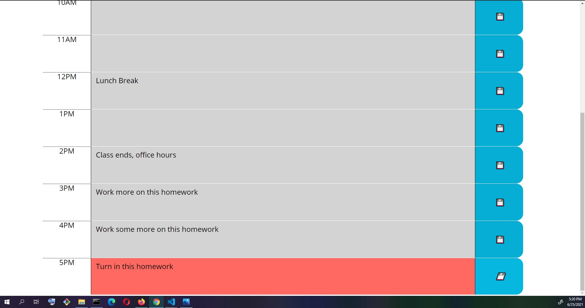

# Work Day Scheduler
Webpage for planning upcoming activities on a hourly basis

## Features

* Handles any starting time and work day length.
* Uses Moment.js to retrieve current hour and style content based on past, present or future.
* Locally stores activities for future page visits.
* Time block elements are cloned with jQuery from an HTML prototype so that every attribute and descendent are easily created. Prototype removed when done.

## Screenshot

## Project Requirements

**Given I am using a daily planner to create a schedule**
* When I open the planner
  * Then the current day is displayed at the top of the calendar
* When I scroll down
  * Then I am presented with timeblocks for standard business hours
* When I view the timeblocks for that day
  * Then each timeblock is color coded to indicate whether it is in the past, present, or future
* When I click into a timeblock
  * Then I can enter an event
* When I click the save button for that timeblock
  * Then the text for that event is saved in local storage
* When I refresh the page
  * Then the saved events persist

